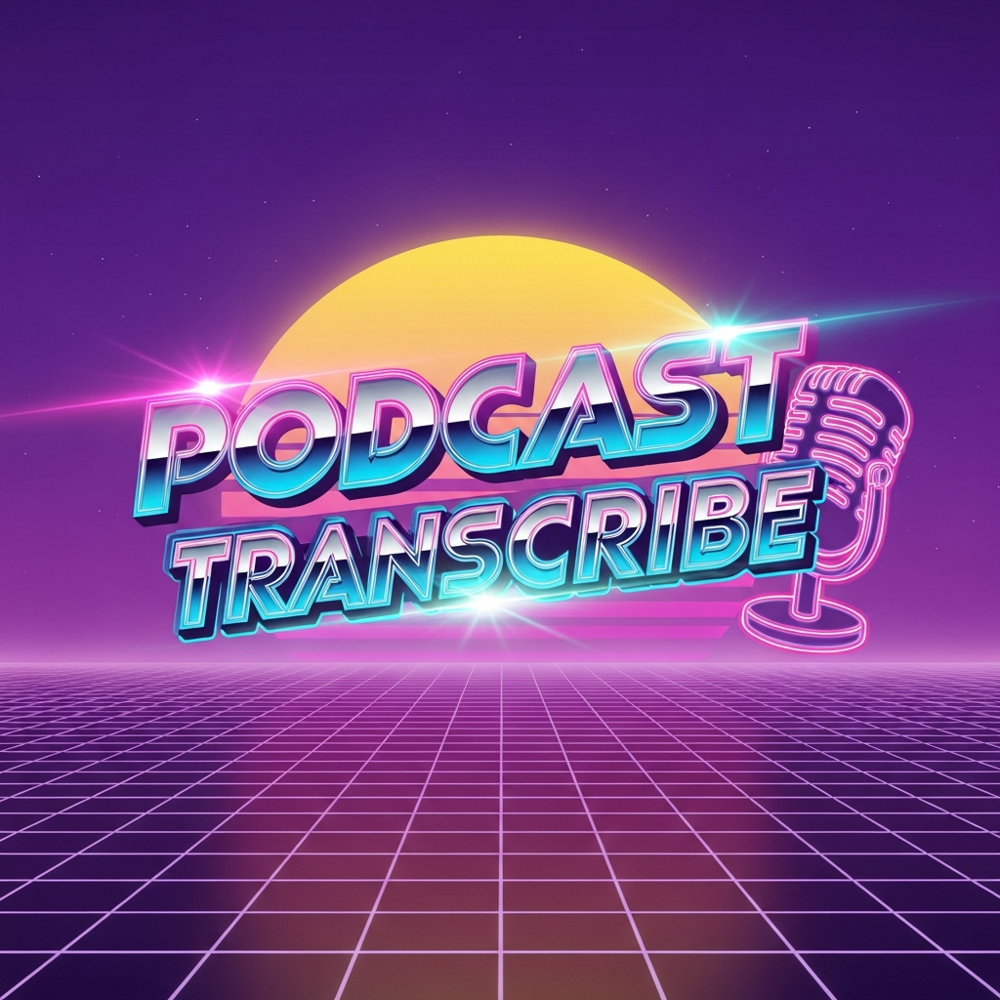
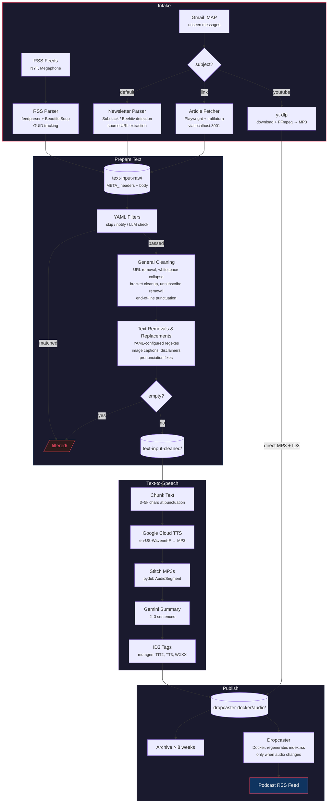

# podcast-transcribe



Convert newsletters, articles, and YouTube videos into a personal podcast feed — automatically.

Substack, Beehiiv, and RSS content is fetched, cleaned, synthesized to speech via Google Cloud TTS, and published as a podcast RSS feed. Runs every 20 minutes via cron.

## Pipeline



## Sources

| Source | Method | Details |
|--------|--------|---------|
| **Substack/Beehiiv newsletters** | Gmail IMAP | Auto-detected via headers and link patterns |
| **Article links** | Email with subject "link" | Fetched via headless Chromium (Playwright) + trafilatura |
| **YouTube** | Email with subject "youtube" | Audio downloaded via yt-dlp, bypasses TTS pipeline |
| **NYT columns** | RSS via Wayback Machine | Ross Douthat, Ezra Klein |
| **Bill Simmons Podcast** | RSS (Megaphone) | Description extracted, NFL episodes flagged via Gemini LLM |

## Text Format

All intermediate files use a simple plain-text format: `META_` header lines, a blank line, then the content body.

```
META_FROM: Author Name
META_TITLE: Article Title
META_SOURCE_URL: https://...
META_SOURCE_KIND: substack
META_INTAKE_TYPE: email

Article text content starts here...
```

## Processing

**Filters** (YAML-configured in `filters.yaml`): Match on metadata fields with `contains`/`not_contains` operators. Actions: `skip` (discard) or `notify` (Gotify push). Optional `llm_check` for fuzzy matching via Gemini.

**Cleaning** (all enabled by default, per-source overrides): URL removal, triple-dash removal, legal bracket unwrap, empty bracket/paren removal, whitespace collapse, unsubscribe/view-online block removal, Substack refs removal, Beehiiv markdown conversion, end-of-line punctuation for TTS pausing.

**Text removals/replacements**: YAML-configured regexes for image captions, disclaimers, pronunciation fixes (e.g. Keynesian -> Cainzeean).

## Speech Synthesis

- **API**: Google Cloud Text-to-Speech (`texttospeech.TextToSpeechClient`)
- **Voice**: `en-US-Wavenet-F`, MP3 encoding
- **Chunking**: 3,000-5,000 characters, split at punctuation/whitespace boundaries
- **Stitching**: pydub `AudioSegment` concatenation
- **Summary**: Gemini `gemini-3.1-flash-lite-preview` generates a 2-3 sentence description

## Tagging & Publishing

- **ID3 tags** via mutagen (v1 + v2): `TIT2` (title), `TT3` (description with summary + source link), `WXXX` (source URL)
- **Feed generation**: Dropcaster (Ruby, Docker) reads MP3 ID3 tags and generates `index.rss`
- **Lifecycle**: Audio older than 8 weeks is archived weekly

## Project Structure

```
podcast-transcribe/
  imap/              # Email intake (parse_email.py)
  rss/               # RSS intake (check-rss.py)
  prepare-text/      # Filtering + cleaning (prepare_text.py, filters.yaml)
  text-to-speech/    # TTS + tagging (text_to_speech.py)
  shared/            # Shared utilities (podcast_shared/)
  dropcaster-docker/ # Feed generation + audio hosting
  process.sh         # Pipeline orchestration
```

Each subdirectory is an independent Python project managed by [uv](https://github.com/astral-sh/uv).

## Requirements

- Python 3.12+ via pyenv + uv
- Docker + Docker Compose (Dropcaster)
- Playwright browsers (`uv run playwright install`)
- ffmpeg on PATH (pydub dependency)
- Local scraper service at `localhost:3001` (article fetching)
- Gmail app password, Gemini API key, Google Cloud TTS service account, Gotify server
